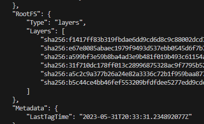

Program został napisany w języku Node.js w wersji 14.0.

Plik z programem został nazwany server.js, w pliku package.json zawiera się konfiguracja. Aby uruchomić server należy wpisać polecenie `node server.js`.
Server nasłuchuje na porcie 3000. Po otworzeniu localhosta z portem 3000 na ekranie dostajemy informacje o adresie IP i datę, natomiast w logach pozostaje data uruchomienia, imię i nazwisko oraz używany port.

W repozytorium został zawarty również plik Dockerfile.

Niezbędne polecenia do:

- zbudowania kontenera: docker build -t zad1-docker .
- uruchomienia kontenera: docker run -p 3000:3000 zad1-docker
- uzyskania informacji: aby uzyskać informację wpisujemy adres http://localhost:3000. Tam otrzymujemy wymienione wyżej informacje na ekranie i w logach.
- sprawdzenia ilości warstw: docker image inspect zad1-docker. Następnie należy znaleźć sekcję layers

Uruchomiony serwer docker:

Sprawdzanie warstw:

