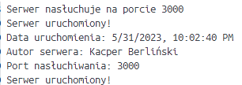

Jako, że po drodze napotkałem problem w postaci błędu [ERROR: multiple platforms feature is currently not supported for docker driver. Please switch to a different driver (eg. "docker buildx create --use")], udało mi się zbudować kontener dla pojedynczej architektury (analogicznie by to wyglądało dla innych).

Polecenie: docker build --platform linux/amd64 -t zad1_dod-docker .

Po uruchomieniu poleceniem "docker run -p 3000:3000 zad1dod-docker" otrzymujemy informacje:

